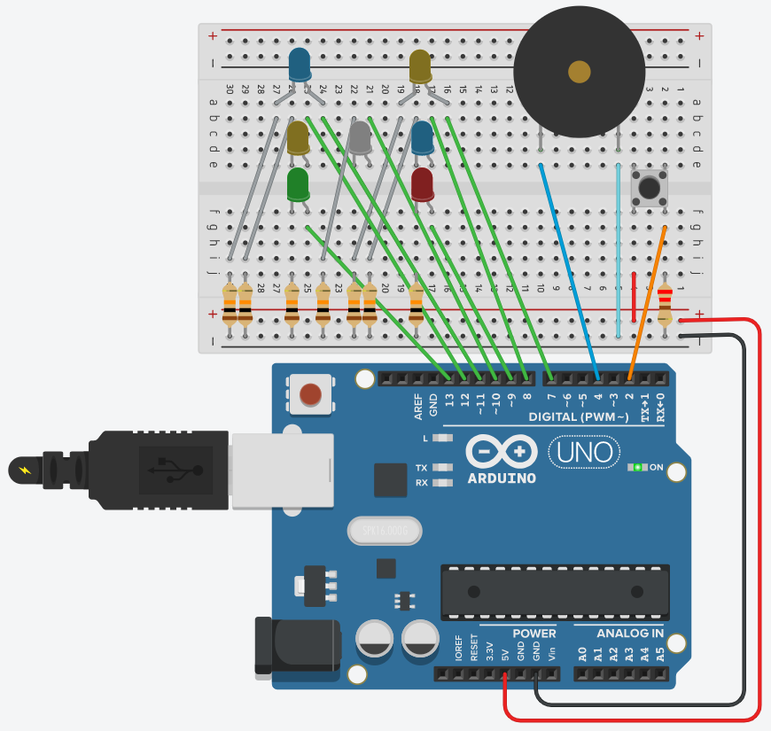

# ARDUINO: INTRODUCCIÓN
# Práctica con LEDs, pulsador y altavoz

Este es un proyecto de un dado simple basado en LEDs, un interruptor de botón, un buzzer y una placa de desarrollo de microcontrolador [Arduino Uno](https://store.arduino.cc/arduino-uno-rev3). Se ha construirlo en una placa de pruebas con los componentes del [Arduino Starter Kit](https://store.arduino.cc/genuino-starter-kit) previa simulación en TINKERCAD.

## Planteamiento
El programa generar un número aleatorio entre 1 y 7 cada vez que se pulse un pulsador y encenderá los diodos LED correspondientes al número aleatorio generado como si se tratara de un dado. Además emite una serie de pitidos correspondiente al número generado.

Los patrones de iluminación de los LEDs para representar los número son:

Los LEDs correspondientes al número estarán encendidos durante un segundo tras la secuencia de pitidos. Pasado este tiempo se deben apagar los diodos LED automáticamente y quedarse a la espera de que se vuelva a pulsar el pulsador.

## La solución
### Hardware
Utilizando el entorno de Circuits de TinKerCad se interconectan todos los componentes sobre la placa de desarrollo. El microcontrolador alimenta los LED a través de resistencias limitadoras de corriente de 10K ohmios desde el comun negativo de la placa. Por otra parte el ánodo de los LEDs se conectan conseutivamente a los pines digitales desde el 13 al 7

Por otra parte el interruptor de botón está conectado al pin 2 digital, que está configurado para usar una resistencia pull-up de 220 ohmnios.

El buzzer (altavoz digital) está directamente conectado al pin 4 digital.

### Software
El programa espera hasta que se presione el botón. En el primer instante del botón pulsado, el programa se genera un número semi-aleatorio. Y este número es el argumento de una función que se encarga de llamar a las rutinas que encienden los LEDs correspondientes al número generado. En cascada se llama también a otra función que emite los pitidos correspondientes al número.

Se divide el código en dos bloques:
* Programa principal con la definición de variables, inicialización y bucle principal.
* Configuración. Constantes y rutinas para mostrar números y emitir los pitidos.

## ¿Qué hemos aprendido?

## Generación de números casi aleatorios.
randomSeed() inicializa el generador de números pseudo aleatorios, haciendo que se inicie en un punto arbitrario en su secuencia aleatoria. Esta secuencia, aunque muy larga, y al azar, es siempre la misma.
Si es importante que la secuencia de valores generados por randomSeed() difiera, en sucesivas ejecuciones de un programa. Por lo que se usa una entrada bastante aletoria leida con analogRead() que tiene que se de un pin desconectado.

## Generación de sonidos a partir de una señal digital

